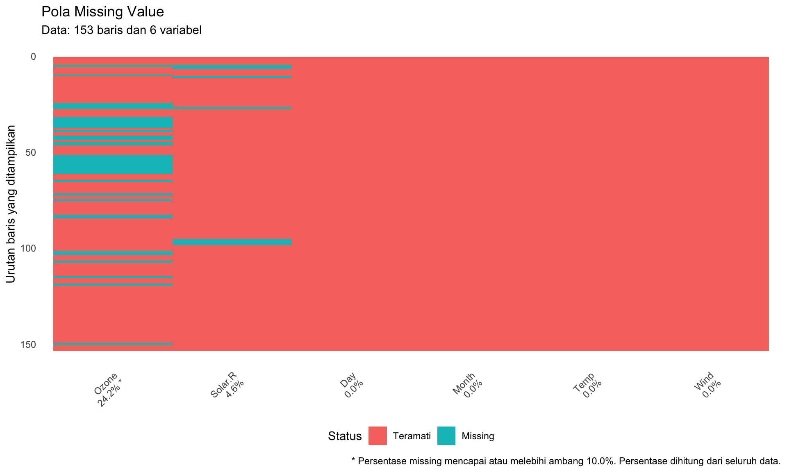
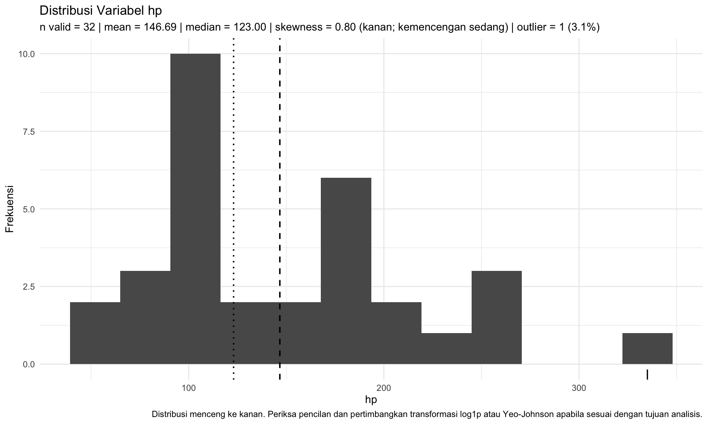
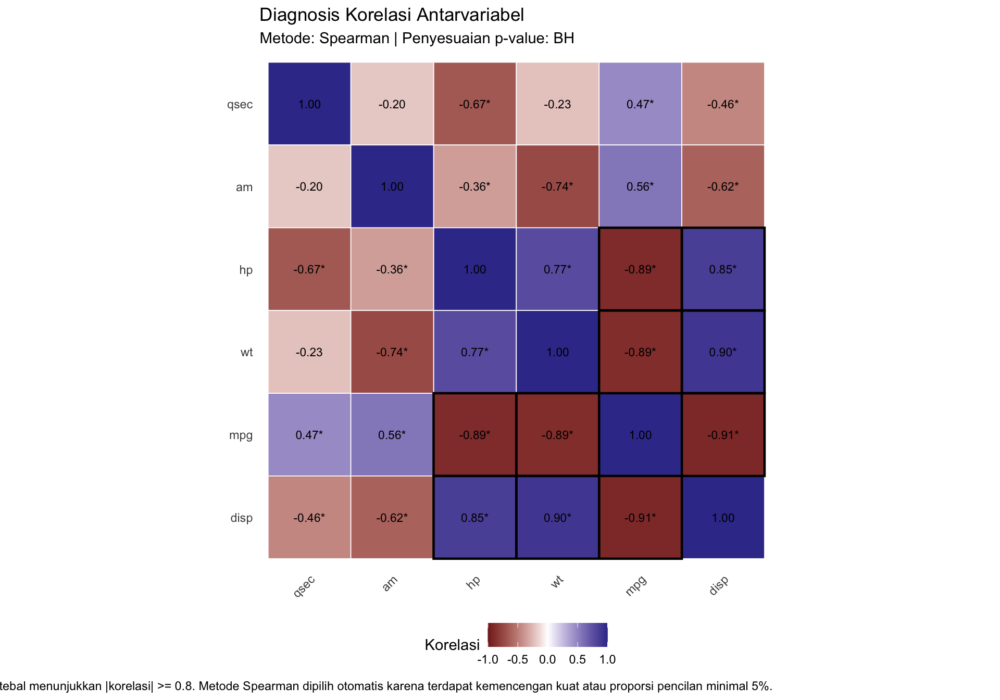

# visdatid

`visdatid` adalah package R untuk diagnosis awal kualitas data melalui
visualisasi *missing value*, distribusi numerik, korelasi, serta laporan
masalah dan rekomendasi prapemrosesan.

Package ini menyediakan empat fungsi utama:

- `vis_miss_adv()` untuk diagnosis dan visualisasi *missing value*;
- `vis_cor_adv()` untuk visualisasi korelasi beserta signifikansinya;
- `vis_distribution()` untuk diagnosis distribusi variabel numerik;
- `quality_report()` untuk menghasilkan laporan masalah kualitas data.

## Attribution

`visdatid` merupakan pengembangan yang mengadopsi dan memperluas konsep
visualisasi awal dari package
[`visdat`](https://github.com/ropensci/visdat).

Package asli `visdat` dikembangkan oleh Nicholas Tierney dan para
kontributornya. `visdatid` tidak dimaksudkan untuk menggantikan
`visdat`, melainkan menambahkan diagnosis statistik dan rekomendasi
awal.

## Installation

Package dapat dipasang langsung dari GitHub:

``` r
install.packages("remotes")
remotes::install_github("mona910/visdatid")
```

Setelah terpasang:

``` r
library(visdatid)
```

# Penggunaan

## Diagnosis missing value dengan `vis_miss_adv()`

Fungsi ini menunjukkan posisi dan persentase *missing value*. Variabel
yang melewati ambang tertentu dapat ditandai sebagai prioritas
pemeriksaan.

``` r
plot_missing <- vis_miss_adv(
  data = airquality,
  threshold = 10,
  sort_by_missing = TRUE,
  show_labels = TRUE
)

plot_missing
```



Ringkasan numeriknya dapat diambil dari atribut `missing_summary`.

``` r
ringkasan_missing <- attr(
  plot_missing,
  "missing_summary"
)

knitr::kable(
  ringkasan_missing,
  digits = 2,
  caption = "Ringkasan missing value"
)
```

| variable | n_missing | pct_missing | flagged |
|:---------|----------:|------------:|:--------|
| Ozone    |        37 |       24.18 | TRUE    |
| Solar.R  |         7 |        4.58 | FALSE   |
| Wind     |         0 |        0.00 | FALSE   |
| Temp     |         0 |        0.00 | FALSE   |
| Month    |         0 |        0.00 | FALSE   |
| Day      |         0 |        0.00 | FALSE   |

Ringkasan missing value

Pada dataset `airquality`, variabel dengan *missing value* terbesar
dapat langsung diketahui dari grafik dan tabel tersebut.

## Diagnosis distribusi dengan `vis_distribution()`

Fungsi ini menampilkan bentuk distribusi, mean, median, skewness, dan
pencilan berdasarkan aturan IQR.

``` r
vis_distribution(
  data = mtcars,
  variable = "hp",
  bins = 12,
  show_outliers = TRUE
)
```



Hasil tersebut dapat digunakan sebagai diagnosis awal sebelum menentukan
apakah suatu variabel memerlukan transformasi atau pemeriksaan pencilan
lebih lanjut.

## Diagnosis korelasi dengan `vis_cor_adv()`

Fungsi ini menampilkan koefisien korelasi, signifikansi setelah
penyesuaian *p-value*, serta penanda untuk korelasi kuat.

``` r
data_korelasi <- mtcars[
  ,
  c("mpg", "disp", "hp", "wt", "qsec", "am")
]

plot_korelasi <- vis_cor_adv(
  data = data_korelasi,
  method = "auto",
  adjust_method = "BH",
  alpha = 0.05,
  strong_threshold = 0.80,
  cluster = TRUE,
  show_values = TRUE,
  show_significance = TRUE,
  digits = 2
)

plot_korelasi
```



Tanda `*` menunjukkan korelasi yang tetap signifikan setelah koreksi
Benjamini–Hochberg. Garis tebal menunjukkan pasangan dengan nilai
absolut korelasi minimal 0,80.

Tabel korelasi lengkap dapat diambil dari atribut `correlation_table`.

``` r
tabel_korelasi <- attr(
  plot_korelasi,
  "correlation_table"
)

pasangan_unik <- tabel_korelasi[
  as.character(tabel_korelasi$row_variable) <
    as.character(tabel_korelasi$column_variable),
  ,
  drop = FALSE
]

pasangan_unik <- pasangan_unik[
  order(
    abs(pasangan_unik$correlation),
    decreasing = TRUE
  ),
  ,
  drop = FALSE
]

knitr::kable(
  utils::head(pasangan_unik, 8),
  digits = 3,
  caption = "Pasangan korelasi utama"
)
```

| row_variable | column_variable | correlation | p_value | adjusted_p_value | n_complete | significant | strong |
|:---|:---|---:|---:|---:|---:|:---|:---|
| disp | mpg | -0.909 | 0 | 0 | 32 | TRUE | TRUE |
| disp | wt | 0.898 | 0 | 0 | 32 | TRUE | TRUE |
| hp | mpg | -0.895 | 0 | 0 | 32 | TRUE | TRUE |
| mpg | wt | -0.886 | 0 | 0 | 32 | TRUE | TRUE |
| disp | hp | 0.851 | 0 | 0 | 32 | TRUE | TRUE |
| hp | wt | 0.775 | 0 | 0 | 32 | TRUE | FALSE |
| am | wt | -0.738 | 0 | 0 | 32 | TRUE | FALSE |
| hp | qsec | -0.667 | 0 | 0 | 32 | TRUE | FALSE |

Pasangan korelasi utama

## Laporan kualitas data dengan `quality_report()`

Fungsi ini memeriksa masalah seperti *missing value*, ID duplikat,
string kosong, variabel konstan, nilai tak hingga, skewness, dan
pencilan IQR.

``` r
data_masalah <- data.frame(
  id = c(1, 2, 2, 4, 5, 6),
  kelompok = c("A", "B", "B", "", NA, "C"),
  nilai = c(10, 12, 12, 100, NA, 15),
  konstan = rep(1, 6)
)

laporan_kualitas <- quality_report(
  data = data_masalah,
  id_col = "id"
)

knitr::kable(
  laporan_kualitas,
  digits = 2,
  caption = "Laporan kualitas data"
)
```

| scope | variable | dimension | issue | value | severity | recommendation |
|:---|:---|:---|:---|:---|:---|:---|
| dataset | NA | keunikan | baris duplikat | 1 dari 6 (16.7%) | tinggi | Periksa apakah baris yang identik merupakan pencatatan berulang atau observasi yang memang sah sebelum menghapusnya. |
| variable | id | keunikan | ID duplikat | 1 dari 6 (16.7%) | tinggi | Periksa apakah setiap nilai ID seharusnya unik dan telusuri observasi yang menggunakan ID yang sama. |
| variable | konstan | variabilitas | variabel konstan | 1 nilai unik | tinggi | Variabel tidak memberikan variasi. Pertimbangkan mengeluarkannya apabila bukan identifier atau variabel administratif yang diperlukan. |
| variable | nilai | distribusi | kemencengan distribusi | 2.22 (kanan; kemencengan kuat) | tinggi | Distribusi menceng ke kanan. Periksa pencilan dan pertimbangkan transformasi log1p atau Yeo-Johnson apabila sesuai dengan tujuan analisis. |
| variable | nilai | distribusi | pencilan IQR | 1 dari 5 (20.0%) | tinggi | Verifikasi pencilan terhadap sumber data dan konteks substantif. Jangan menghapus pencilan secara otomatis. |
| variable | kelompok | kelengkapan | missing value | 1 dari 6 (16.7%) | sedang | Telusuri pola missing dan pilih metode penanganan yang sesuai dengan tujuan analisis. |
| variable | kelompok | konsistensi | string kosong | 1 dari 6 (16.7%) | sedang | Periksa makna string kosong dan standardisasikan menjadi kategori yang benar atau missing value bila sesuai. |
| variable | nilai | kelengkapan | missing value | 1 dari 6 (16.7%) | sedang | Telusuri pola missing dan pilih metode penanganan yang sesuai dengan tujuan analisis. |

Laporan kualitas data

Setiap baris laporan memuat jenis masalah, nilai hasil pemeriksaan,
tingkat keparahan, dan rekomendasi tindak lanjut.

# Hasil pemeriksaan package

Package telah diperiksa menggunakan `devtools::check()` dengan hasil:

``` text
0 errors
0 warnings
1 note
```

Note yang muncul adalah:

``` text
checking for future file timestamps ...
unable to verify current time
```

Note tersebut berkaitan dengan lingkungan sistem dan tidak berasal dari
fungsi atau source code package.

Pengujian otomatis menghasilkan:

``` text
FAIL 0
WARN 0
SKIP 0
PASS 219
```

Output lengkap tersedia pada [`check_result.txt`](check_result.txt).

# Batas penggunaan

`visdatid` digunakan untuk diagnosis dan rekomendasi awal. Package ini
tidak melakukan imputasi, transformasi, penghapusan pencilan, atau
pembersihan data secara otomatis.
